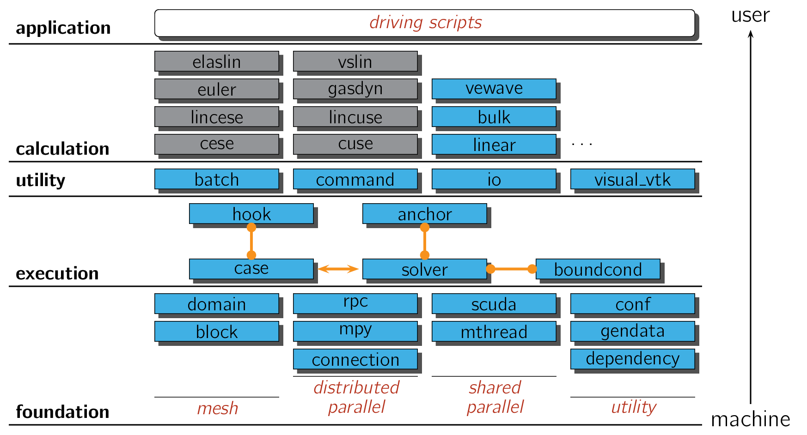
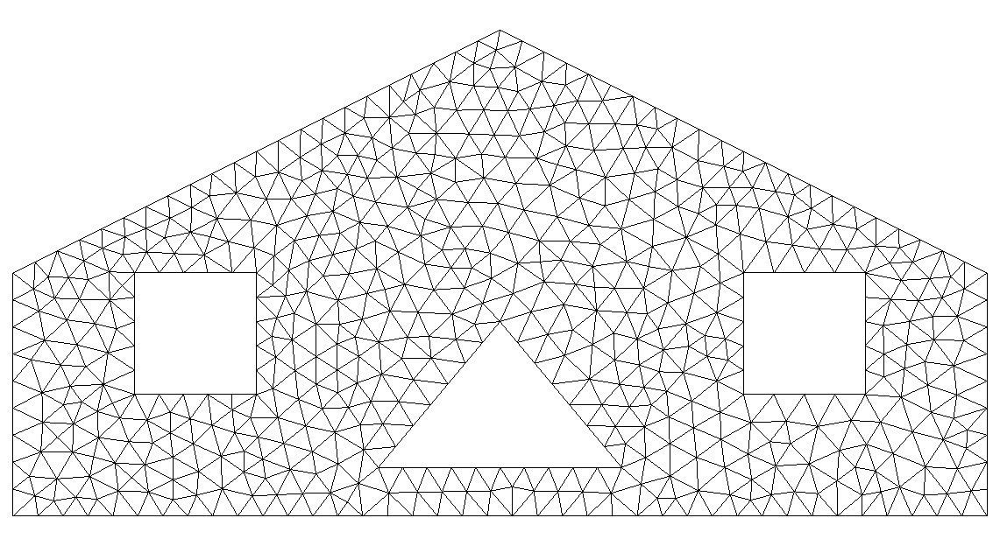
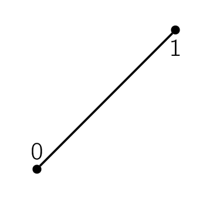
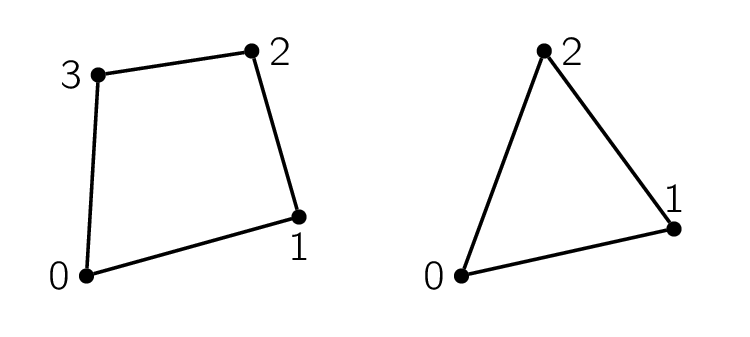
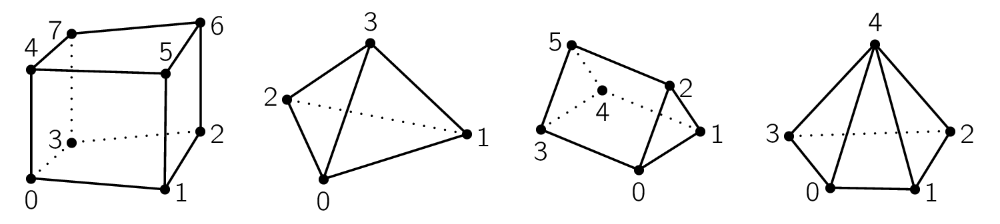
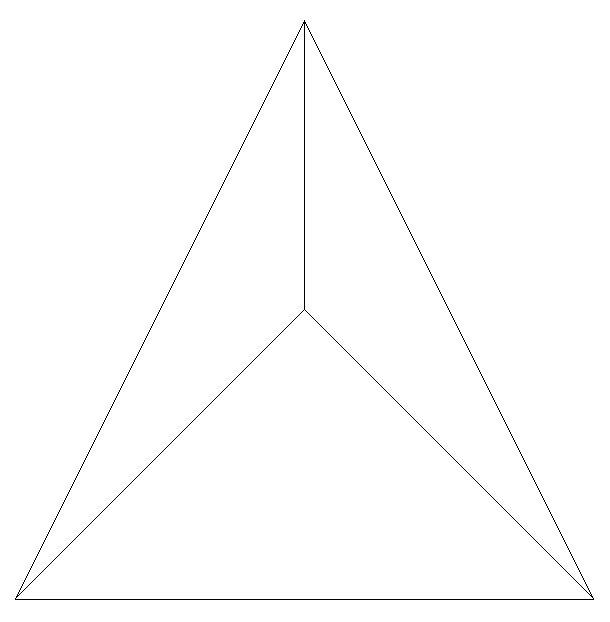

============
Architecture
============

SOLVCON is built upon two keystones: (i) unstructured meshes for spatial
discretization and (ii) two-level loop structure of partial differential
equation (PDE) solvers.  The data structure of unstructured meshes forms the
foundation layer, and the two basic loops forms the execution layer, as shown
in Figure :ref:`fig_stack`.  The two basic constructs supports the modules for
physical processes and numerical methods, on which applications are developed.

The layered architecture of SOLVCON allows users to write Python scripts to
drive the whole system.  This design helps automating simulations a lot.
Moreover, components in lower levels can be replaced in the driving scripts,
such that experimenting with new algorithms or implementation becomes very
easy.

.. _fig_stack:

  Architecture of SOLVCON

Unstructured Meshes
===================

We usually discretize the spatial domain of interest before solving PDEs with
digital computers.  The discretized space is called a *mesh* [Mavriplis97]_.
When discretization is done by exploiting regularity in space, like cutting
along each of the Cartesian coordinate axes, the discretized space is called a
*structured mesh*.  If the discretization does not follow any spatial order, we
call the spatial domain an *unstructured mesh*.  Both meshing strategies have
their strength and weakness.  Sometimes a structured mesh is also call a
*grid*.  Numerical methods that rely on spatial discretization are called
*mesh-based* or *grid-based*.  Most PDE-solving methods in production uses are
mesh-based, but meshless methods have their advantages.

To accommodate complex geometry, SOLVCON chose to use unstructured meshes of
mixed elements.  Because no structure is assumed for the geometry to be
modeled, the mesh can be automatically generated by using computer programs.
For example, the following image shows a triangular mesh of a two-dimensional
irregular domain:

  Two-dimensional sample mesh

which is generated by using the `Gmsh <http://geuz.org/gmsh/>`__ commands
listed in `ustmesh_2d_sample.geo`_.  On the other hand, creation of structured
meshes often needs a large amount of manual operations and will not be
discussed in this document.

In SOLVCON, we assume a mesh is fully covered by a finite number of
non-overlapping sub-regions, and only composed by these sub-regions.  The
sub-regions are called *mesh elements*.  In one-dimensional space, SOLVCON also
defines one type of mesh elements, *line*, as shown in Figure :ref:`f_elm_1d`.

.. _f_elm_1d:

  One-dimensional mesh element

SOLVCON allows two types of two-dimensional mesh elements, *quadrilaterals* and
*triangles*, as shown in Figure :ref:`f_elm_2d`, and four types of
three-dimensional mesh elements, *hexahedra*, *tetrahedra*, *prisms*, and
*pyramids*, as shown in Figure :ref:`f_elm_3d`.

.. _f_elm_2d:

  Two-dimensional mesh elements

.. _f_elm_3d:

  Three-dimensional mesh elements

The numbers annotated in the figures are the order of the vertices of the
elements.  A SOLVCON mesh can be a mixture of elements of the same dimension,
although it is often composed of one type of element.  Two modules provide the
support of the meshes: (i) :py:class:`solvcon.block` defines and manages
various look-up tables that form the data structure of the mesh in Python, and
(ii) :py:class:`solvcon.mesh` serves as the interface of the mesh data in C.

Entities
++++++++

Before explaining the data structure of the meshes, we need to introduce some
basic terminologies and definitions.  In SOLVCON, a *cell* means a mesh
element.  The dimensionality of a cell equals to that of the mesh it belongs
to, e.g., a two-dimensional mesh is composed by two-dimensional cells.  A cell
is assumed to be concave, and enclosed by a set of *faces*.  The dimensionality
of a face is one less than that of a cell.  A face is also assumed to be
concave, and formed by connecting a sequence of *nodes*.  The dimensionality of
a node is at least one less than that of a face.  Cells, faces, and nodes are
the basic constructs, which we call *entities*, of a SOLVCON mesh.

Defining the term "entity" for SOLVCON facilitates a unified treatment of two-
and three-dimensional meshes and the corresponding solvers [1]_.  A cell can be
either two- or three-dimensional, and the associated faces become one- or
two-dimensional, respectively.  Because a face is either one- or
two-dimensional, it can always be formed by a sequence of points, which is
zero-dimensional.  In this treatment, a point is equivalent to a node defined
in the previous passage.

Take the two-dimensional mesh shown above as an example, triangular elements
are used as the cells.  The triangles are formed by three lines
(one-dimensional shapes), which are the faces.  Each line has two points
(zero-dimensional).  If we have a three-dimensional mesh composed by hexahedral
cells, then the faces should be quadrilaterals (two-dimensional shapes).

All the mesh elements supported by SOLVCON are listed in the following table.
The first column is the name of the element, and the second column is the type
ID used in SOLVCON.  The third column lists the dimensionality.  The fourth,
fifth, and sixth columns show the number of zero-, one-, and two-dimensional
*sub*-entities belong to the element type, respectively.  Note that the terms
"point" and "line" appear in both the first row and first column, for they are
the only element type in the space of the corresponding dimensionality.

+---------------+------+-----+--------+-------+----------+
| Name          | Type | Dim | Point# | Line# | Surface# |
+===============+======+=====+========+=======+==========+
| Point         |    0 |   0 |      0 |     0 |        0 |
+---------------+------+-----+--------+-------+----------+
| Line          |    1 |   1 |      2 |     0 |        0 |
+---------------+------+-----+--------+-------+----------+
| Quadrilateral |    2 |   2 |      4 |     4 |        0 |
+---------------+------+-----+--------+-------+----------+
| Triangle      |    3 |   2 |      3 |     3 |        0 |
+---------------+------+-----+--------+-------+----------+
| Hexahedron    |    4 |   3 |      8 |    12 |        6 |
+---------------+------+-----+--------+-------+----------+
| Tetrahedron   |    5 |   3 |      4 |     4 |        4 |
+---------------+------+-----+--------+-------+----------+
| Prism         |    6 |   3 |      6 |     9 |        5 |
+---------------+------+-----+--------+-------+----------+
| Pyramid       |    7 |   3 |      5 |     8 |        5 |
+---------------+------+-----+--------+-------+----------+

Although SOLVCON doesn't support one-dimensional solvers, for completeness, we
define the relation between one-dimensional cells (lines) and their
sub-entities as:

+--------------+------+-----------------+
| Shape (type) | Face | = Point         |
+==============+======+=================+
| Line (0)     |    0 | :math:`\cdot` 0 |
+              +------+-----------------+
|              |    1 | :math:`\cdot` 1 |
+--------------+------+-----------------+

That is, as shown in Figure :ref:`f_elm_1d`, a one-dimensional "cell" (line)
has two "faces", which are essentially point 0 and point 1.  Symbol
:math:`\cdot` indicates a point.

It will be more practical to illustrate the relation between two-dimensional
cells and their sub-entities in a table (see Figure :ref:`f_elm_2d` for point
locations):

+-------------------+------+-------------------------+
| Shape (type)      | Face | = Line formed by points |
+===================+======+=========================+
| Quadrilateral (2) |    0 | :math:`\diagup` 0 1     |
+                   +------+-------------------------+
|                   |    1 | :math:`\diagup` 1 2     |
+                   +------+-------------------------+
|                   |    2 | :math:`\diagup` 2 3     |
+                   +------+-------------------------+
|                   |    3 | :math:`\diagup` 3 0     |
+-------------------+------+-------------------------+
| Triangle (3)      |    0 | :math:`\diagup` 0 1     |
+                   +------+-------------------------+
|                   |    1 | :math:`\diagup` 1 2     |
+                   +------+-------------------------+
|                   |    2 | :math:`\diagup` 2 0     |
+-------------------+------+-------------------------+

Symbol :math:`\diagup` indicates a line.  The orientation of lines of each
two-dimensional shape is defined to follow the right-hand rule.  The shape
enclosed by the lines has an area normal vector points to the direction of
:math:`+z` (outward paper/screen).

The relation between three-dimensional cells and their sub-entities is defined
in the table (see Figure :ref:`f_elm_3d` for point locations):

+-----------------+------+----------------------------+
| Shape (type)    | Face | = Surface formed by points |
+=================+======+============================+
| Hexahedron (4)  |    0 | :math:`\square` 0 3 2 1    |
+                 +------+----------------------------+
|                 |    1 | :math:`\square` 1 2 6 5    |
+                 +------+----------------------------+
|                 |    2 | :math:`\square` 4 5 6 7    |
+                 +------+----------------------------+
|                 |    3 | :math:`\square` 0 4 7 3    |
+                 +------+----------------------------+
|                 |    4 | :math:`\square` 0 1 5 4    |
+                 +------+----------------------------+
|                 |    5 | :math:`\square` 2 3 7 6    |
+-----------------+------+----------------------------+
| Tetrahedron (5) |    0 | :math:`\triangle` 0 2 1    |
+                 +------+----------------------------+
|                 |    1 | :math:`\triangle` 0 1 3    |
+                 +------+----------------------------+
|                 |    2 | :math:`\triangle` 0 3 2    |
+                 +------+----------------------------+
|                 |    3 | :math:`\triangle` 1 2 3    |
+-----------------+------+----------------------------+
| Prism (6)       |    0 | :math:`\triangle` 0 1 2    |
+                 +------+----------------------------+
|                 |    1 | :math:`\triangle` 3 5 4    |
+                 +------+----------------------------+
|                 |    2 | :math:`\square` 0 3 4 1    |
+                 +------+----------------------------+
|                 |    3 | :math:`\square` 0 2 5 3    |
+                 +------+----------------------------+
|                 |    4 | :math:`\square` 1 4 5 2    |
+-----------------+------+----------------------------+
| Pyramid (7)     |    0 | :math:`\triangle` 0 4 3    |
+                 +------+----------------------------+
|                 |    1 | :math:`\triangle` 1 4 0    |
+                 +------+----------------------------+
|                 |    2 | :math:`\triangle` 2 4 1    |
+                 +------+----------------------------+
|                 |    3 | :math:`\triangle` 3 4 2    |
+                 +------+----------------------------+
|                 |    4 | :math:`\square` 0 3 2 1    |
+-----------------+------+----------------------------+

Symbol :math:`\square` indicates a quadrilateral, while symbol
:math:`\triangle` indicates a triangle.

Because a face is associated to two adjacent cells unless it's a boundary face,
it needs to identify to which cell it belongs, and to which cell it is
neighbor.  The area normal vector of a face is always point from the belonging
cell to neighboring cell.  The same rule applies to faces of two-dimensional
meshes (lines) too.

Data Structure
++++++++++++++

.. py:module:: solvcon.block

Real data of unstructured meshes are stored in module
:py:class:`solvcon.block`.  A simple table for all element types is defined as
:py:obj:`elemtype`:

.. py:data:: elemtype

  A :py:class:`numpy.ndarray` object of shape (8, 5) and type ``int32``.  This
  array is a reference table for element types in SOLVCON.  The content is
  shown in the first table in Section `Entities`_.  Each row represents an
  element type.  The first column is the index of the element type, the second
  the dimensionality, the third column the number of points, the fourth the
  number lines, and the fifth the number of surfaces.

Class :py:class:`Block` contains descriptive information, look-up tables, and
other miscellaneous information for a SOLVCON mesh.  There are three steps
required to fully construct a :py:class:`Block` object: (i) instantiation, (ii)
definition, and (iii) build-up.  In the first step, when instantiating an
object, shape information must be provided to the constructor to allocate
arrays for look-up tables:

.. code-block:: python

  from solvcon.block import Block
  blk = Block(ndim=2, nnode=4, ncell=3)

Second, we fill the definition of the look-up tables into the object.  We at
least need to provide the node coordinates and the node lists of cells:

.. code-block:: python

  blk.ndcrd[:,:] = (0,0), (-1,-1), (1,-1), (0,1)
  blk.cltpn[:] = 3
  blk.clnds[:,:4] = (3, 0,1,2), (3, 0,2,3), (3, 0,3,1)

Third and finally, we build up the rest of the object by calling:

.. code-block:: python

  blk.build_interior()
  blk.build_boundary()
  blk.build_ghost()

By running the additional code, the block can be saved as a VTK file for viewing:

.. code-block:: python

  from solvcon.io.vtkxml import VtkXmlUstGridWriter
  iodev = VtkXmlUstGridWriter(blk)
  iodev.write('block_2d_sample.vtu')

.. _block_2d_sample:

  A simple :py:class:`Block` object

.. py:class:: Block(ndim=0, nnode=0, nface=0, ncell=0, nbound=0, use_incenter=False)

  This class represents the unstructured meshes used in SOLVCON.  As such, in
  SOLVCON, an unstructured mesh is also called a *block*.  The following six
  attributes can be passed into the constructor.  :py:attr:`ndim`,
  :py:attr:`nnode`, and :py:attr:`ncell` need to be non-zero to instantiate a
  valid block.  :py:attr:`nface` and :py:attr:`nbound` might be different to
  the given value after building up the object.  :py:attr:`use_incenter` is an
  optional flag.

  .. py:attribute:: ndim

    :type: :py:class:`int`

    Number of dimensionalities of this mesh.  Read only after instantiation.

  .. py:attribute:: nnode

    :type: :py:class:`int`

    Total number of (non-ghost) nodes of this mesh.  Read only after
    instantiation.

  .. py:attribute:: nface

    :type: :py:class:`int`

    Total number of (non-ghost) faces of this mesh.  Read only after
    instantiation.

  .. py:attribute:: ncell

    :type: :py:class:`int`

    Total number of (non-ghost) cells of this mesh.  Read only after
    instantiation.

  .. py:attribute:: nbound

    :type: :py:class:`int`

    Total number of boundary faces or ghost cells of this mesh.  Read only
    after instantiation.

  .. py:attribute:: use_incenter

    :type: :py:class:`bool`

    Indicates calculating incenters instead of centroids for cells.  Default is
    ``False`` (using centroids of cells).
  
  To construct a block object, SOLVCON needs to know the dimensionalities
  (:py:attr:`ndim`), the number of nodes (:py:attr:`nnode`), faces
  (:py:attr:`nface`), and cells (:py:attr:`ncell`), and the number of boundary
  faces (:py:attr:`nbound`) of the mesh.  These keyword parameters are taken to
  initialize the following properties:

  The meshes are mainly defined by three sets of look-up tables (arrays).  The
  first set is the geometry arrays, which store the coordinate values of mesh
  elements:

  .. py:attribute:: ndcrd
    
    Coordinates of nodes.  It's a two-dimensional :py:class:`numpy.ndarray`
    array of shape (:py:attr:`nnode`, :py:attr:`ndim`) of type ``float64``.

  .. py:attribute:: fccnd
  
    Centroids of faces.  It's a two-dimension :py:class:`numpy.ndarray` of
    shape (:py:attr:`nface`, :py:attr:`ndim`) of type ``float64``.

  .. py:attribute:: fcnml
  
    Unit normal vectors of faces.  It's a two-dimension
    :py:class:`numpy.ndarray` of shape (:py:attr:`nface`, :py:attr:`ndim`) of
    type ``float64``.

  .. py:attribute:: fcara
  
    Areas of faces.  The value should always be non-negative.  It's a
    one-dimension :py:class:`numpy.ndarray` of shape (:py:attr:`nface`,) of
    type ``float64``.

  .. py:attribute:: clcnd
  
    Centroids of cells.  It's a two-dimension :py:class:`numpy.ndarray` of
    shape (:py:attr:`ncell`, :py:attr:`ndim`) of type ``float64``.

  .. py:attribute:: clvol
  
    Volumes of cells.  It's a one-dimension :py:class:`numpy.ndarray` of shape
    (:py:attr:`ncell`,) of type ``float64``.

  The second set is the meta-data or type data arrays:

  .. py:attribute:: fctpn

    Type ID of faces.  It's a one-dimensional :py:class:`numpy.ndarray` of
    shape (:py:attr:`nface`,) of type ``int32``.

  .. py:attribute:: cltpn

    Type ID of cells.  It's a one-dimensional :py:class:`numpy.ndarray` of
    shape (:py:attr:`ncell`,) of type ``int32``.

  .. py:attribute:: clgrp

    Group ID of cells.  It's a one-dimensional :py:class:`numpy.ndarray` of
    shape (:py:attr:`ncell`,) of type ``int32``.  For a new :py:class:`Block`
    object, it should be initialized with ``-1``.

  The third and last set is the connectivity arrays:

  .. py:attribute:: fcnds

    Lists of the nodes of each face.  It's a two-dimensional
    :py:class:`numpy.ndarray` of shape (:py:attr:`nface`, :py:attr:`FCMND`\ +1)
    and type ``int32``.

  .. py:attribute:: fccls

    Lists of the cells connected by each face.  It's a two-dimensional
    :py:class:`numpy.ndarray` of shape (:py:attr:`nface`, 4) and type
    ``int32``.

  .. py:attribute:: clnds

    Lists of the nodes of each cell.  It's a two-dimensional
    :py:class:`numpy.ndarray` of shape (:py:attr:`ncell`, :py:attr:`CLMND`\ +1)
    and type ``int32``.

  .. py:attribute:: clfcs

    Lists of the faces of each cell.  It's a two-dimensional
    :py:class:`numpy.ndarray` of shape (:py:attr:`ncell`, :py:attr:`CLMFC`\ +1)
    and type ``int32``.

  Every look-up array has two associated arrays distinguished by different
  prefixes: (i) ``gst`` (denoting for "ghost") and (ii) ``sh`` (denoting for
  "shared").  SOLVCON uses the technique of ghost cells to treat boundary
  conditions [Mavriplis97]_, and the ``gst`` arrays store the information for
  ghost cells.  However, to facilitate efficient indexing in solvers, each of
  the ghost arrays should be put in a continuous block of memory adjacent to
  its interior counterpart.  In SOLVCON, the ``sh`` arrays are the continuous
  memory blocks for both ghost and interior look-up tables, and a pair of
  ``gst`` and normal arrays is simply the views of two consecutive,
  non-overlapping sub-regions of a memory block.  More details of the technique
  of ghost cells will be given in module :py:mod:`solvcon.mesh`.

  There are some attributes associated with ghost cells:

  .. py:attribute:: ngstnode

    :type: :py:class:`int`

    Number of nodes only associated with ghost cells.  Only valid after
    build-up.  Read only.

  .. py:attribute:: ngstface

    :type: :py:class:`int`

    Number of faces only associated with ghost cells.  Only valid after
    build-up.  Read only.

  .. py:attribute:: ngstcell

    :type: :py:class:`int`

    Number of ghost cells.  Only valid after build-up.  Read only.

  Three arrays need to be defined before we can build up a :py:class:`Block`
  object: (i) :py:attr:`ndcrd`, (ii) :py:attr:`cltpn`, and (iii)
  :py:attr:`clnds`.  With these information, :py:meth:`build_interior` builds
  up the interior arrays for a :py:class:`Block` object.
  :py:meth:`build_boundary` then organizes the information for boundary
  conditions.  Finally, :py:meth:`build_ghost` builds up the shared and ghost
  arrays for the :py:class:`Block` object.  Only after the build-up process,
  the :py:class:`Block` object can be used by solvers.

  .. automethod:: build_interior
  .. automethod:: build_boundary
  .. automethod:: build_ghost

  A :py:class:`Block` object also contains three instance variables for
  boundary-condition treatments:

  .. py:attribute:: bclist

    :type: :py:class:`list`

    The list of associated :py:class:`solvcon.boundcond.BC` objects.

  .. py:attribute:: nbound

    :type: :py:class:`int`

    Number of boundary faces.  Only valid after build-up.  It should equals to
    :py:attr:`ngstcell`.

  .. py:attribute:: bndfcs

    :type: :py:class:`numpy.ndarray`

    The array is of shape (:py:attr:`nbound`, 2) and type ``int32``.  Each row
    contains the data for a boundary face.  The first column is the 0-based
    index of the face, while the second column is the serial number of the
    associated :py:class:`solvcon.boundcond.BC` object.

  .. automethod:: create_msh

.. py:currentmodule:: solvcon.block

In class :py:class:`Block` there are also useful constants defined:

  .. py:attribute:: Block.FCMND

    :type: :py:attr:`int`

    The maximum number of nodes that a face can have.  From the first table in
    Section `Entities`_, its value should be 4.

  .. py:attribute:: Block.CLMND

    :type: :py:attr:`int`

    The maximum number of nodes that a cell can have.  From the first table in
    Section `Entities`_, its value should be 8.

  .. py:attribute:: Block.CLMFC

    :type: :py:attr:`int`

    The maximum number of faces that a cell can have.  From the first table in
    Section `Entities`_, its value should be 6.

Low-Level Interface to C
++++++++++++++++++++++++

.. py:module:: solvcon.mesh

Although it is convenient to have data structure defined in the Python module
:py:mod:`solvcon.block`, kernel of numerical methods are usually implemented in
C.  To bridge Python and C, we use `Cython <http://cython.org/>`__ to write an
interfacing module :py:mod:`solvcon.mesh`.  This module enables C code to use
the mesh data held by a :py:mod:`solvcon.block.Block` object, and allows Python
to use those C functions.

A header file ``mesh.h`` contains the essential declarations to use the mesh
data:

.. c:type:: sc_mesh_t

  This ``struct`` is the counterpart of the Python class
  :py:class:`solvcon.block.Block` in C.  It contains four sections of fields in
  order.

  The first field section is for shape.  These fields correspond to the
  instance properties (attributes) in :py:class:`solvcon.block.Block` of the
  same names:

  .. c:member:: int ndim
  .. c:member:: int nnode
  .. c:member:: int nface
  .. c:member:: int ncell
  .. c:member:: int nbound
  .. c:member:: int ngstnode
  .. c:member:: int ngstface
  .. c:member:: int ngstcell

  The second field section is for geometry arrays.  These fields correspond to
  the instance variables (attributes) in :py:class:`solvcon.block.Block` of the
  same names:

  .. note::
  
    All arrays in :c:type:`sc_mesh_t` are shared arrays but the pointers point
    to the start of their interior portion.  In this way, access to ghost
    information can be efficiently done by using negative indices of nodes,
    faces, and cells in the first dimension of these arrays.  But negative
    indices in higher dimensions of the arrays is meaningless.

  .. c:member:: double* ndcrd
  .. c:member:: double* fccnd
  .. c:member:: double* fcnml
  .. c:member:: double* fcara
  .. c:member:: double* clcnd
  .. c:member:: double* clvol

  The third field section is for type/meta arrays.  These fields correspond to
  the instance variables (attributes) in :py:class:`solvcon.block.Block` of the
  same names:

  .. c:member:: int* fctpn
  .. c:member:: int* cltpn
  .. c:member:: int* clgrp

  The fourth and final field section is for connectivity arrays.  These fields
  correspond to the instance variables (attributes) in
  :py:class:`solvcon.block.Block` of the same names:

  .. c:member:: int* fcnds
  .. c:member:: int* fccls
  .. c:member:: int* clnds
  .. c:member:: int* clfcs

The SOLVCON C library (``libsolvcon.a``) contains five mesh-related functions
that are used internally in :py:class:`Mesh`.  These functions are not meant to
be part of the interface, but can be a reference about the usage of
:c:type:`sc_mesh_t`:

.. c:function:: int sc_mesh_extract_faces_from_cells(sc_mesh_t *msd, \
    int mface, int *pnface, int *clfcs, int *fctpn, int *fcnds, int *fccls)

  This function extracts interior faces from the node lists of the cells given
  in the first argument ``msd``.  The second argument ``mface`` is also an
  input, which sets the maximum value of possible number of faces to be
  extracted.

  The rest of the arguments is outputs.  The arrays pointed by the last four
  arguments need to be pre-allocated with appropriate size or the memory will
  be corrupted.

.. c:function:: int sc_mesh_calc_metric(sc_mesh_t *msd, int use_incenter)

  This function calculates the geometry information and stores the calculated
  values into the arrays specified in ``msd``.  The second argument
  ``use_incenter`` is a flag.  When it is set to ``1``, the function calculates
  and stores the incenter of the cells.  Otherwise, the function calculates and
  stores the centroids of the cells.

.. c:function:: void sc_mesh_build_ghost(sc_mesh_t *msd, int *bndfcs)

  Build all information for ghost cells by mirroring information from interior
  cells.  The arrays in the first argument ``msd`` will be altered, but data in
  the second argument ``bndfcs`` will remain intact.  The action includes:

  1. Define indices and build connectivities for ghost nodes, faces, 
     and cells.  In the same loop, mirror the coordinates of interior 
     nodes to ghost nodes.
  2. Compute center coordinates for faces for ghost cells.
  3. Compute normal vectors and areas for faces for ghost cells.
  4. Compute center coordinates for ghost cells.
  5. Compute volume for ghost cells.
 
  It should be noted that all the geometry, type/meta and connectivity data
  used in this function are SHARED arrays rather than interior arrays.  The
  indices for ghost information should be carefully treated.  All the ghost
  indices are negative in shared arrays.

.. c:function:: int sc_mesh_build_rcells(sc_mesh_t *msd, \
    int *rcells, int *rcellno)

  This is a utility function used by :py:meth:`Mesh.create_csr`.  The first
  argument ``msd`` is input and will not be changed, and the output will be
  write to the second and third arguments, ``rcells`` and ``rcellno``.
  Sufficient memory must be pre-allocated for the output arrays before calling
  or memory can be corrupted.

.. c:function:: int sc_mesh_build_csr(sc_mesh_t *msd, int *rcells, int *adjncy)

  This is a utility function used by :py:meth:`Mesh.create_csr`.  The first
  argument ``msd`` and the second argument ``rcells`` are input and will not be
  changed, while the third argument ``adjncy`` is output.  Sufficient memory
  must be pre-allocated for the output array before calling or memory can be
  corrupted.

A Python class :py:class:`Mesh` is written by using Cython to convert a
Python-space :py:class:`solvcon.block.Block` object into a :c:type:`sc_mesh_t`
``struct`` variable for use in C.  This class is meant to be subclassed to
implement the core number-crunching algorithm of a numerical method.  In
addition, this class also provides functionalities that need the C utility
functions listed above.

.. py:class:: Mesh

  This class associates the C functions for mesh operations to the mesh data
  and exposes the functions to Python.

  .. py:attribute:: _msd

    This attribute holds a C ``struct`` :c:type:`sc_mesh_t` for internal use.

  .. py:method:: setup_mesh(blk)

    :param blk: The block object to be copied from.
    :type blk: :py:class:`solvcon.block.Block`

  .. py:method:: extract_faces_from_cells(max_nfc)

    :param max_nfc: Maximum value of possible number of faces to be extracted.
    :type max_nfc: C :c:type:`int`
    :return: Four interior :py:class:`numpy.ndarray` for
      :py:class:`solvcon.block.Block.clfcs`,
      :py:class:`solvcon.block.Block.fctpn`,
      :py:class:`solvcon.block.Block.fcnds`, and
      :py:class:`solvcon.block.Block.fccls`.

    Internally calls :c:func:`sc_mesh_extract_face_from_cells`.

  .. py:method:: calc_metric()

    :return: Nothing.

    Calculates geometry information including normal vector and area of faces,
    and centroid/incenter coordinates and volume of cells.  Internally calls
    :c:func:`sc_mesh_calc_metric`.

  .. py:method:: build_ghost()

    :return: Nothing.

    Builds data for ghost cells.  Internally calls
    :c:func:`sc_mesh_build_ghost`.

  .. py:method:: create_csr()

    :return: xadj, adjncy
    :rtype: tuple of :py:class:`numpy.ndarray`

    Builds the connectivity graph in the CSR (compressed storage format) used
    by SCOTCH/METIS.  Internally calls :c:func:`sc_mesh_build_rcells` and
    :c:func:`sc_mesh_build_csr`.

  .. py:method:: partition(npart, vwgtarr=None)

    :param npart: Number of parts to be partitioned to.
    :type npart: C :c:type:`int`
    :keyword vwgtarr: vwgt weighting settings.  Default is :py:obj:`None`.
    :type vwgtarr: :py:class:`numpy.ndarray`
    :return: A 2-tuple of (i) number of cut edges for the partitioning and (ii)
      a :py:class:`numpy.ndarray` of shape
      (:py:attr:`solvcon.block.Block.ncell`,) and type ``int32`` that indicates
      the partition number of each cell in the mesh.
    :rtype: :py:class:`int`, :py:class:`numpy.ndarray`

    Internally calls :c:func:`METIS_PartGraphKway` of the SCOTCH library for
    mesh partitioning.

Numerical Code
==============

As the data structure and facilities are defined (in Section "`Unstructured
Meshes`_"), we are now ready to develop code for numerical methods.  The
numerical calculations in SOLVCON rely on exploiting a two-level loop
structure, i.e., the temporal loop and the spatial loops.  For time-accurate
solvers, there is always an outer loop that coordinates the time-marching.  The
outer loop is called the *temporal loop*, and it should be implemented in
subclasses of :py:class:`solvcon.case.MeshCase`.  Inside the temporal loop,
there can be one or many inner loops that calculate the new values of the
fields.  The inner loops are called the *spatial loops*, and they should be
implemented in subclasses of :py:class:`solvcon.solver.MeshSolver`.

Although time-marching needs both the temporal and the spatial loops, the outer
temporal loop is more responsible for coordinating, while the inner spatial
loops is closer to numerical algorithms.  The nature of these two levels allows
us to segregate code.  An object of :py:class:`solvcon.case.MeshCase` can be
seen as the realization of a simulation case in SOLVCON (as a convention the
object's name should contain or just be ``cse``).  Code in
:py:class:`solvcon.case.MeshCase` is mainly about obtaining settings, provision
of the execution environment, input, and output.  On the other hand, an object
of :py:class:`solvcon.solver.MeshSolver` is used to manipulate the field data
by the implemented numerical algorithm (as a convention the object's name
should contain or just be ``svr``).  Its code shouldn't involve input nor
output (excepting that for debugging) but needs to take parallelism into
account.

The two classes :py:class:`solvcon.case.MeshCase` and
:py:class:`solvcon.solver.MeshSolver` establish good segregation for numerical
methods, but to make code flexible, SOLVCON provides a companion for each of
the classes.  A :py:class:`solvcon.case.MeshCase` object can contain one or
more :py:class:`solvcon.hook.MeshHook` objects to perform custom operations at
certain pre-defined stages (as a convention the objects should be named with
``hok``).  Similarly, a :py:class:`solvcon.solver.MeshSolver` object can have
one or more :py:class:`solvcon.anchor.MeshAnchor` objects for processing field
data by using code that is not part of the numerical algorithm (as a convention
the objects should be named with ``ank``).  In this section, for conciseness,
the terms case, solver, hook, and anchor are sometimes referred to as the
classes :py:class:`solvcon.case.MeshCase`,
:py:class:`solvcon.solver.MeshSolver`, :py:class:`solvcon.hook.MeshHook`, and
:py:class:`solvcon.anchor.MeshAnchor`, respectively, or their instances,
respectively.

.. py:module:: solvcon.case

Case
++++

Module :py:mod:`solvcon.case` contains code for making a simulation case
(subclasses of :py:class:`solvcon.case.MeshCase`).  Because a case coordinates
the whole process of a simulation run, for parallel execution, there can be
only one :py:class:`MeshCase` object residing in the controller (head) node.

By the design, :py:class:`MeshCase` itself cannot be directly used.  It must be
subclassed to implement control logic for a specific application.  The
application can be a concrete model for a certain physical process, or an
abstraction of a group of related physical processes, which can be further
subclassed.

.. autoclass:: MeshCase

  .. inheritance-diagram:: MeshCase

  :py:meth:`init` and :py:meth:`run` are the two primary methods responsible
  for the execution of the simulation case object.  Both methods accept a
  keyword parameter "level":

  - run level 0: fresh run (default),
  - run level 1: restart run,
  - run level 2: initialization only.

  .. automethod:: cleanup

Initialize
----------

.. automethod:: MeshCase.init

Time-March
----------

.. automethod:: MeshCase.run

Arrangement
-----------

.. py:data:: arrangements

  The module-level registry for arrangements.

.. py:attribute:: MeshCase.arrangements

  The class-level registry for arrangements.

.. automethod:: MeshCase.register_arrangement

.. py:module:: solvcon.solver

Solver
++++++

.. autoclass:: MeshSolver

  Both time-accurate and steady-state numerical methods are supported by this
  class.  Steady-state methods can be viewed as special cases of time-accurate
  ones.  Two instance attributes are used to record the temporal information:
  
  .. py:attribute:: time
  
    The current time of the solver.  By default, :py:attr:`time` is initialized
    to ``0.0``, which is usually desired value.  The default value can be
    overridden from the constructor.
      
  .. py:attribute:: time_increment
  
    The temporal interval between the current and the next time steps.  It is
    usually referred to as :math:`\Delta t` in the numerical literature.  By
    default, :py:attr:`time_increment` is initialized to ``0.0``, but the
    default should be overridden from the constructor.

  The status of time-marching are stored in the following four members are
  used:
  
  .. py:attribute:: step_current
  
    It is an :py:class:`int` that records the current step of the solver.  It
    is initialized to ``0``.
  
  .. py:attribute:: step_global
  
    It is similar to :py:attr:`step_current`, but persists over restart.
    Without restarts, :py:attr:`step_global` should be identical to
    :py:attr:`step_current`.
  
  .. py:attribute:: substep_run
  
    The number of sub-steps that a single time step should be split into.  It
    is initialized to ``1`` and should be overidden in subclasses if needed.
  
  .. py:attribute:: substep_current
  
    The current sub-step of the solver.  It is initialized to ``0``.

  .. py:attribute:: _MMNAMES

    This class attribute holds the names of the methods to be called in
    :py:meth:`march`.  It is of type :py:class:`_MethodList`.  The default
    value is ``None`` and must be set again in subclasses.

  .. automethod:: new_method_list

  .. py:attribute:: runanchors

    This instance attribute is of type :py:class:`solvcon.anchor.AnchorList`,
    and the foundation of the anchor mechanism of SOLVCON.  An
    :py:class:`solvcon.anchor.AnchorList` object like this collects a set of
    :py:class:`solver.anchor.Anchor` objects, and is callable.  When being
    called, :py:attr:`runanchors` iterates the contained
    :py:class:`solvcon.anchor.Anchor` objects and invokes the corresponding
    method of the anchor.

  .. automethod:: march

    This method performs time-marching.  The parameters ``time`` and
    ``time_increment`` are used to reset the instance attributes
    :py:attr:`time` and :py:attr:`time_increment`, respectively.

    There is a nested two-level loop in this method for time-marching.  The
    outer loop iterates for time steps, and the inner loop iterates for sub
    time steps.  The outer loop runs ``steps_run`` times, while the inner loop
    runs :py:attr:`substep_run` times.  In total, the inner loop runs
    ``steps_run`` * :py:attr:`substep_run` times.  In each sub time step (in
    the inner loop), the increment of the attribute :py:attr:`time` is
    :py:attr:`time_increment`/:py:attr:`substep_run`.  The temporal increment
    per time step is effectively :py:attr:`time_increment`, with a slight error
    because of round-off.

    Before entering and after leaving the outer loop, ``premarch`` and
    ``postmarch`` anchors will be run (through the attribute
    :py:attr:`runanchors`).  Similarly, before entering and after leaving the
    inner loop, ``prefull`` and ``postfull`` anchors will be run.  Inside the
    inner loop of sub steps, before and after executing all the marching
    methods, ``presub`` and ``postsub`` anchors will be run.  Lastly, before
    and after invoking every marching method, a pair of anchors will be run.
    The anchors for a marching method are related to the name of the marching
    method itself.  For example, if a marching method is named "calcsome",
    anchor ``precalcsome`` will be run before the invocation, and anchor
    ``postcalcsome`` will be run afterward.

  .. automethod:: detect_ncore

  For distributed-memory parallel computing (i.e., MPI runs), the member
  :py:attr:`svrn` indicates the serial number (0-based) the object is.  The
  value of :py:attr:`svrn` comes from :py:attr:`blk`.  Another member,
  :py:attr:`nsvr`, is the total number of collaborative solvers in the parallel
  run, and is initialized to ``None``.

To achieve high-performance in SOLVCON, the implementation of a numerical
method is divided into two parts: (i) a solver class and (ii) an algorithm
class.  A solver class is responsible for providing the API and managing
memory, while an algorithm class is responsible for number-crunching in C.
Users usually only see the solver class.  Intensive calculation is delegated to
the algorithm class from the solver class.  Two modules,
:py:mod:`solvcon.fake_solver` and :py:mod:`solvcon.fake_algorithm`, are put in
SOLVCON to exemplify the delegation structure by using a dummy numerical
method.

.. note::

  For a PDE-solving method, code written in Python is in general two orders of
  magnitude slower than that written in C or Fortran.  And Cython code is still
  a bit (percentages or times) slower than C code.  Hence, in reality, we need
  to write C code for speed.

Example Solver
--------------

.. py:module:: solvcon.fake_solver

The :py:mod:`solvcon.fake_solver` module contains the
:py:class:`FakeSolver` class that defines the API for the
dummy numerical method.

.. py:class:: FakeSolver

  This class represents the Python side of the numerical method.  It
  instantiates a :py:class:`solvcon.fake_algorithm.FakeAlgorithm` object.
  Computation-intensive tasks are delegated to the algorithm object.

  .. py:method:: create_alg

    Create a :py:class:`solvcon.fake_algorithm.FakeAlgorithm` object and return it.

  .. py:attribute:: MMNAMES

    An ordered registry for all names of methods to be called by a marcher.  Any
    methods to be called by a marcher should be registered into it.

  The following six methods are for the numerical methods.  They are registered
  into :py:attr:`MMNAMES` by the present order.

  .. py:method:: update

    Update the present solution arrays with the next solution arrays.

  .. py:method:: calcsoln

    Calculate the ``soln`` array.

  .. py:method:: ibcsoln

    Interchange BC for the ``soln`` array.

  .. py:method:: calccfl

    Calculate the CFL number.

  .. py:method:: calcdsoln

    Calculate the ``dsoln`` array.

  .. py:method:: ibcdsoln

    Interchange BC for the ``dsoln`` array.

.. py:module:: solvcon.fake_algorithm

The :py:mod:`solvcon.fake_algorithm` module contains the
:py:class:`FakeAlgorithm` that interfaces to the number-crunching C code.

.. py:class:: FakeAlgorithm

  This class represents the C side of the numerical method.  It wraps two C
  functions :c:func:`sc_fake_algorithm_calc_soln` and
  :c:func:`sc_fake_algorithm_calc_dsoln`.

  .. py:method:: setup_algorithm(svr)

    A :py:class:`FakeAlgorithm` object shouldn't allocate memory.  Instead, a
    :py:class:`solvcon.fake_solver.FakeSolver` object should allocate the memory
    and pass the solver into the algorithm.

  .. py:method:: calc_soln

    Wraps the C functions :c:func:`sc_fake_algorithm_calc_soln`.  Do the work
    delegated from :py:meth:`solvcon.fake_solver.FakeSolver.calcsoln`.

  .. py:method:: calc_dsoln

    Wraps the C functions :c:func:`sc_fake_algorithm_calc_dsoln`.  Do the work
    delegated from :py:meth:`solvcon.fake_solver.FakeSolver.calcdsoln`.

Hook
++++

Anchor
++++++

Code Listings
=============

ustmesh_2d_sample.geo
+++++++++++++++++++++

.. literalinclude:: ../../contrib/gmsh/ustmesh_2d_sample.geo
  :language: c

The following command generate the mesh:

.. code-block:: bash

  gmsh ustmesh_2d_sample.geo -3

The following command converts the mesh to a VTK file for ParaView:

.. code-block:: bash

  scg mesh ustmesh_2d_sample.msh ustmesh_2d_sample.vtk

References
==========

.. [Mavriplis97] D. J. Mavriplis, Unstructured grid techniques, Annual Review
  of Fluid Mechanics 29. (1997)

.. rubric:: Footnotes

.. [1] SOLVCON focuses on two- and three-dimensional meshes.  But if we put an
  additional constraint on the mesh elements: Requiring them to be simplices,
  it wouldn't be difficult to extend the data structure of SOLVCON meshes into
  higher-dimensional space.

.. vim: set spell ff=unix fenc=utf8 ft=rst:
