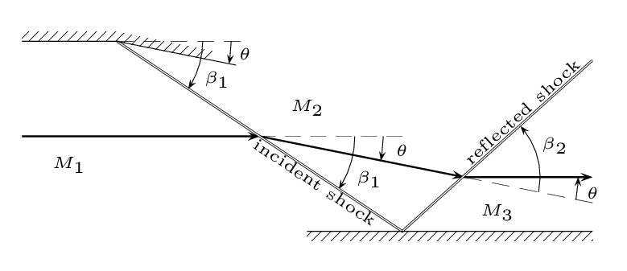
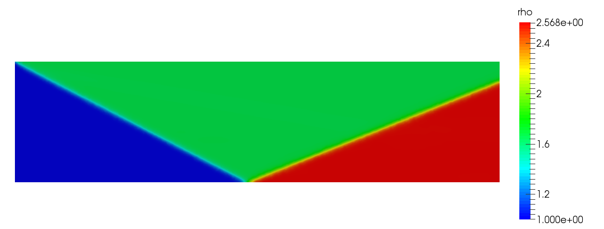
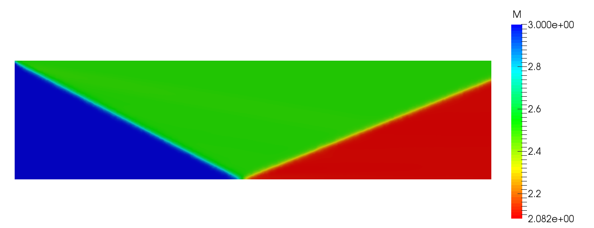
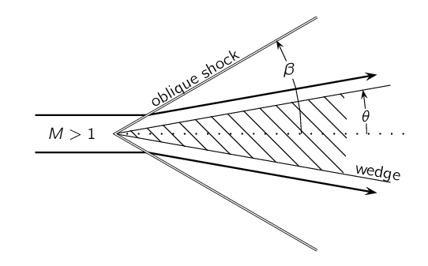
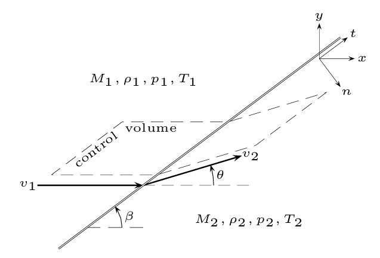

================================
Reflection of Oblique Shock Wave
================================

.. py:module:: solvcon.parcel.gas.oblique_shock

This example solves a reflecting oblique shock wave, as shown in Figure
:num:`fig-reflection`.  The system consists of two oblique shock waves, which
separate the flow into three zones.  The incident shock results from a wedge.
The second reflects from a plane wall.  Flow properties in all the three zones
can be calculated with the following data:

1. The upstream (zone 1) Mach number :math:`M_1` and the flow properties
   density, pressure, and temperature.
2. The first oblique shock angle :math:`\beta_1` (between zone 1 and 2) or the
   flow deflection angle :math:`\theta` (across zone 1/2 and zone 2/3).  Only
   one of the angle is needed.  The other one can be calculated from the given
   one and :math:`M_1`.  The calculation detail is in
   :py:meth:`ObliqueShockRelation.calc_flow_angle` and
   :py:meth:`ObliqueShockRelation.calc_shock_angle`.

.. _fig-reflection:

  Oblique shock reflected from a wall

  :math:`M_{1,2,3}` are the Mach number in the corresponding zone 1, 2, and 3.
  :math:`\theta` is the flow deflection angle.  :math:`\beta_{1,2}` are the
  oblique shock angle behind the first and the second zone, respectively.

SOLVCON will be set up to solve this problem, and the simulated results will be
compared with the analytical solution.

.. _fig-obrf-fine-rho:

  Simulated density (non-dimensionalized).

Driving Script
==============

SOLVCON uses a driving script to control the numerical simulation.  Its general
layout is:

.. code-block:: python
  :linenos:

  #!/usr/bin/env python2.7
  # The shebang above directs the operating system to look for a correct
  # program to run this script.
  #
  # We may provide additional information here.

  # Import necessary modules.
  import os # Python standard library
  import numpy as np # http://www.numpy.org
  import solvcon as sc # SOLVCON
  from solvcon.parcel import gas # A specific SOLVCON solver package we'll use

  # ...
  # ... other code ...
  # ...

  # At the end of the file.
  if __name__ == '__main__':
      sc.go()

Every driving script has the following lines at the end of the file:

.. code-block:: python

  if __name__ == '__main__':
      sc.go()

The ``if __name__ == '__main__':`` is a magical Python construct.  It will
detect that the file is run as a script, not imported as a library (module).
Once the detection is evaluated as true, the script call a common execution
flow defined in :py:meth:`solvcon.go`, which uses the content of the driving
script to perform the calculation.

Of course, the file has a lot of other code to set up and configure the
calculation, as we'll describe later.  It's important to note that a driving
script is a valid Python program file.  The Python language is good for
specifying parameters the calculation needs, and as a platform to conduct
useful operations much more complex than settings.  Any Python module can be
imported for use.

See :ref:`obrfgo` for the driving script of this example:
``$SCSRC/examples/gas/obrf/go``.  SOLVCON separates apart the configuration and
the execution of a simulation case.  The separation is necessary for
distributed-memory parallel computing (e.g., MPI).  Everything run in the
driving script is about the configuration.  The execution is conducted by code
hidden from users.

To run the simulation, go to the example directory and execute the driving
script with the command ``run`` and the simulation arrangement name ``obrf``::

  $ ./go run obrf

The driving script will then run and print messages:

.. literalinclude:: ../../../examples/gas/obrf/run.example.log
  :linenos:

Data will be output in directory ``result/``.

Arrangement
===========

An *arrangement* sits at the center of a driving script.  It's nothing more
than a decorated Python function with a specific signature.  The following
function :py:meth:`obrf` is the main arrangement we'll use for the shock
reflection problem:

.. literalinclude:: ../../../examples/gas/obrf/go
  :language: python
  :linenos:
  :pyobject: obrf

It's typical for the arrangement function :py:meth:`obrf` to be a thin wrapper
which calls another function (in this case, :py:meth:`obrf_base`).  It should
be noted that an arrangement function must take one and **only one** positional
argument: *casename*.  All the other arguments need to be keyword.

To make the function :py:meth:`obrf` discoverable by SOLVCON, it needs to be
registered with the decorator :py:class:`gas.register_arrangement`
(:py:mod:`~solvcon.parcel.gas` was imported at the beginning of the driving
script):

.. code-block:: python

  @gas.register_arrangement
  def obrf(casename, **kw):
      # ... contents ...

The function :py:meth:`obrf_base` does the real work of configuration:

.. literalinclude:: ../../../examples/gas/obrf/go
  :language: python
  :linenos:
  :pyobject: obrf_base

There are three steps:

1. Obtain the `Analytical Solution`_ to set up all quantities for the
   simulation.

2. Instantiate the simulation case object (of type
   :py:class:`~solvcon.parcel.gas.GasCase`).  The
   :py:class:`~solvcon.parcel.gas.GasCase` object needs to know how to set up
   the mesh (see `Mesh Generation`_) and the boundary-condition (BC) treatment
   (see `BC Treatment Mapping`_).  Section `Case Instantiation`_ will explain
   the details.

3. Configure callbacks for delayed operations by calling
   :py:meth:`~solvcon.MeshCase.defer` of the constructed simulation
   :py:class:`~solvcon.parcel.gas.GasCase` object.  Section `Callback
   Configuration`_ will explain these callbacks.

At the end of the base function, the constructed and configured
:py:class:`~solvcon.parcel.gas.GasCase` object is returned.

Although the example has only one arrangement, it's actually encouraged to have
multiple arrangements in a script.  In this way one driving script can perform
simulations of different parameters or different kinds.  Conventionally we
place the arrangement functions near the end of the driving script, and the
decorated functions (e.g., :py:meth:`obrf`) are placed after the base (e.g.,
:py:meth:`obrf_base`).  The ordering will make the file easier to read.

Analytical Solution
+++++++++++++++++++

To set up the numerical simulation for the shock-reflection problem, we'll use
class :py:class:`ObliqueShockRelation` to calculate necessary parameters by
creating a subclass of it:

.. literalinclude:: ../../../examples/gas/obrf/go
  :language: python
  :linenos:
  :pyobject: ObliqueShockReflection

For the detail of :py:class:`ObliqueShockRelation`, see
:ref:`sec-oblique-shock-relation`.

Case Instantiation
++++++++++++++++++

An instance of :py:class:`~solvcon.parcel.gas.GasCase` represents a numerical
simulation using the :py:class:`~solvcon.parcel.gas` module.  In addition to
`Mesh Generation` and `BC Treatment Mapping`, other miscellaneous settings can
be supplied through the :py:class:`~solvcon.parcel.gas.GasCase` constructor.

Mesh Generation
---------------

An unstructured mesh is required for a SOLVCON simulation.  A mesh file can be
created beforehand or on-the-fly with the simulation.  The example uses the
latter approach.  The following is an example of mesh generating function that
calls `Gmsh <http://geuz.org/gmsh/>`__:

.. literalinclude:: ../../../examples/gas/obrf/go
  :language: python
  :linenos:
  :pyobject: RectangleMesher

BC Treatment Mapping
--------------------

Boundary-condition treatments are specified by creating a :py:class:`dict` to
map the name of the boundary to a specific :py:class:`~solvcon.boundcond.BC`
class.

.. literalinclude:: ../../../examples/gas/obrf/go
  :language: python
  :linenos:
  :pyobject: generate_bcmap

Callback Configuration
++++++++++++++++++++++

SOLVCON provides general-purpose, application-agnostic solving facilities.  To
describe the problem to SOLVCON, we need to provide both data (numbers) and
logic (computer code) in the driving script.  The supplied code will be called
back at proper points while the simulation is running.

Classes :py:class:`~solvcon.hook.MeshHook` and
:py:class:`~solvcon.anchor.MeshAnchor` are the fundamental constructs to make
callbacks in the sequential and parallel runtime environment, respectively.
The module :py:mod:`~solvcon.parcel.gas` includes useful callbacks, but we
still need to write a couple of them in the driving script.

The shock reflection problem uses three categories of callbacks.

1. Initialization and calculation:

  - :py:class:`~solvcon.parcel.gas.FillAnchor`
  - :py:class:`~solvcon.parcel.gas.DensityInitAnchor`
  - :py:class:`~solvcon.parcel.gas.PhysicsAnchor`

2. Reporting:

  - :py:meth:`ObliqueShockReflection.hookcls`
  - :py:class:`~solvcon.parcel.gas.ProgressHook`
  - :py:class:`~solvcon.parcel.gas.CflHook`
  - :py:class:`~solvcon.parcel.gas.MeshInfoHook`
  - :py:class:`ReflectionProbe`

3. Output:

  - :py:class:`~solvcon.parcel.gas.PMarchSave`

The order of these callbacks is important.  Dependency between callbacks is
allowed.

View Results
============

After simulation, the results are stored in directory ``result/`` as VTK
unstructured data files that can be opened and processed by using `ParaView
<http://paraview.org/>`__.  The result in Figure :num:`fig-obrf-fine-rho` was
produced in this way.  Other quantities can also be visualized, e.g., the Mach
number shown in Figure :num:`fig-obrf-fine-mach`.

.. _fig-obrf-fine-mach:

  Mach number at the final time step of the arrangement ``obrf_fine``.

Both of Figures :num:`fig-obrf-fine-rho` and :num:`fig-obrf-fine-mach` are
obtained with the arrangement ``obrf_fine``.

.. _sec-oblique-shock-relation:

Oblique Shock Relation
======================

An oblique shock results from a sudden change of direction of supersonic flow.
The relations of density (:math:`\rho`), pressure (:math:`p`), and temprature
(:math:`T`) across the shock can be obtained analytically [Anderson03]_.  In
addition, two angles are defined:

1. The angle of the oblique shock wave deflected from the upstream is
   :math:`\beta`; the shock angle.
2. The angle of the flow behind the shock wave deflected from the upstream is
   :math:`\theta`; the flow angle.

See Figure :num:`fig-oblique-shock` for the illustration of the two angles.

.. _fig-oblique-shock:

  Oblique shock wave by a wedge

  :math:`M` is Mach number.  :math:`\theta` is the flow deflection angle.
  :math:`\beta` is the oblique shock angle.

Methods of calculating the shock relations are organized in the class
:py:class:`ObliqueShockRelation`.  To obtain the relations of density
(:math:`\rho`), pressure (:math:`p`), and temprature (:math:`T`), the control
volume across the shock is emplyed, as shown in Figure
:num:`fig-oblique-relation`.  In the figure and in
:py:class:`ObliqueShockRelation`, subscript 1 denotes upstream properties and
subscript 2 denotes downstream properties.  Derivation of the relation uses a
rotated coordinate system :math:`(n, t)` defined by the oblique shock, where
:math:`\hat{n}` is the unit vector normal to the shock, and :math:`\hat{t}` is
the unit vector tangential to the shock.  But in this document we won't go into
the detail.

.. _fig-oblique-relation:

  Properties across an oblique shock

  The flow properties in the upstream zone of the oblique shock are :math:`v_1,
  M_1, \rho_1, p_1, T_1`.  Those in the downstream zone of the shock are
  :math:`v_2, M_2, \rho_2, p_2, T_2`.

.. autoclass:: ObliqueShockRelation

  .. autoinstanceattribute:: gamma
    :annotation:

:py:class:`ObliqueShockRelation` provides three methods to calculate the ratio
of flow properties across the shock.  :math:`M_1` and :math:`\beta` are
required arguments:

- :math:`\rho`: :py:meth:`~ObliqueShockRelation.calc_density_ratio`
- :math:`p`: :py:meth:`~ObliqueShockRelation.calc_pressure_ratio`
- :math:`T`: :py:meth:`~ObliqueShockRelation.calc_temperature_ratio`

With :math:`M_1` available, the shock angle :math:`\beta` can be calculated
from the flow angle :math:`\theta`, or vice versa, by using the following two
methods:

- :math:`\beta`: :py:meth:`ObliqueShockRelation.calc_shock_angle`
- :math:`\theta`: :py:meth:`ObliqueShockRelation.calc_flow_angle`

The following method calculates the downstream Mach number, with the upstream
Mach number :math:`M_1` and either of :math:`\beta` or :math:`\theta` supplied:

- :math:`M_2`: :py:meth:`~ObliqueShockRelation.calc_dmach`

Listing of all methods:

- :py:meth:`~ObliqueShockRelation.calc_density_ratio`
- :py:meth:`~ObliqueShockRelation.calc_pressure_ratio`
- :py:meth:`~ObliqueShockRelation.calc_temperature_ratio`
- :py:meth:`~ObliqueShockRelation.calc_dmach`
- :py:meth:`~ObliqueShockRelation.calc_normal_dmach`
- :py:meth:`~ObliqueShockRelation.calc_flow_angle`
- :py:meth:`~ObliqueShockRelation.calc_flow_tangent`
- :py:meth:`~ObliqueShockRelation.calc_shock_angle`
- :py:meth:`~ObliqueShockRelation.calc_shock_tangent`
- :py:meth:`~ObliqueShockRelation.calc_shock_tangent_aux`

.. automethod:: ObliqueShockRelation.calc_density_ratio
.. automethod:: ObliqueShockRelation.calc_pressure_ratio
.. automethod:: ObliqueShockRelation.calc_temperature_ratio
.. automethod:: ObliqueShockRelation.calc_dmach
.. automethod:: ObliqueShockRelation.calc_normal_dmach
.. automethod:: ObliqueShockRelation.calc_flow_angle
.. automethod:: ObliqueShockRelation.calc_flow_tangent
.. automethod:: ObliqueShockRelation.calc_shock_angle
.. automethod:: ObliqueShockRelation.calc_shock_tangent
.. automethod:: ObliqueShockRelation.calc_shock_tangent_aux

.. _obrfgo:

Full Listing of the Driving Script
==================================

.. literalinclude:: ../../../examples/gas/obrf/go
  :language: python
  :linenos:
